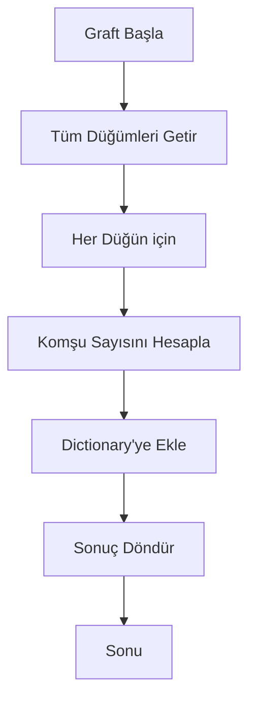
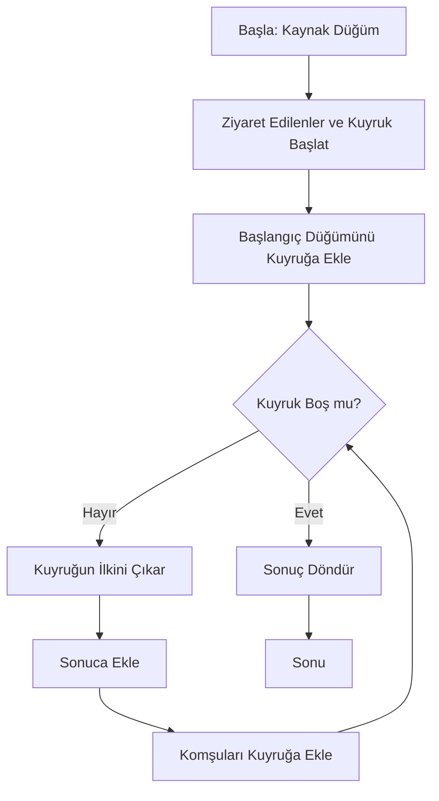
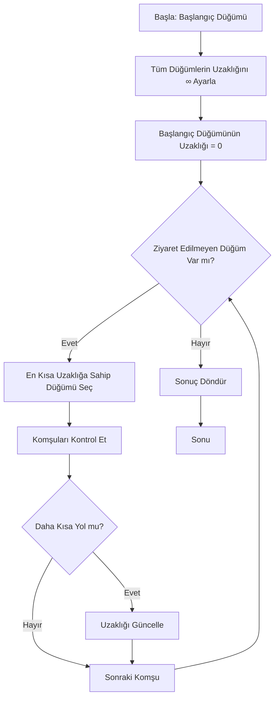
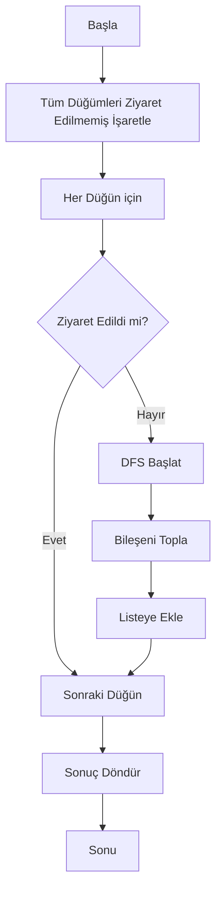
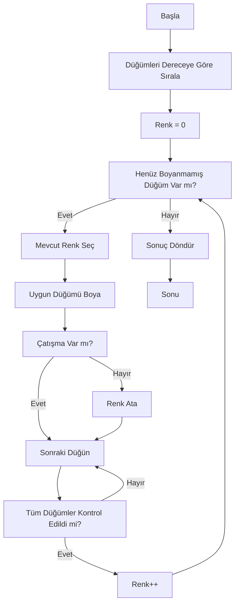
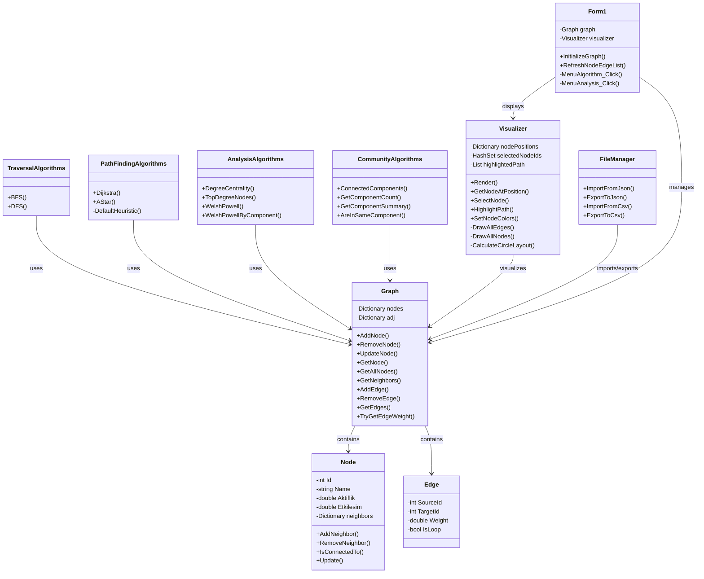

# Sosyal Ağ Analiz Uygulaması

## 1. Proje Bilgileri

**Proje Adı:** Social Network Analysis Application (Sosyal Ağ Analiz Uygulaması)

**Ekip Üyeleri:** Umut Kuzu , Türkay Jafarlı

**Tarih:** 2025

**Platform:** .NET 10 (C# 14.0)

---

## 2. Giriş ve Problem Tanımı

### 2.1 Problemin Tanımı

Sosyal ağlar günümüzde insanlar arasındaki ilişkileri ve etkileşimleri temsil etmek için önemli bir araçtır. Sosyal ağlardaki kullanıcıları (düğümler) ve aralarındaki ilişkileri (kenarlar) analiz etmek, sosyal dinamikleri anlamada kritik bir rol oynar. Bu proje, çeşitli graf algoritmaları kullanarak sosyal ağ yapısını analiz etmeyi amaçlamaktadır.

### 2.2 Amaç

- **Sosyal ağ modelleme:** Kullanıcıları düğüm, ilişkileri kenar olarak temsil eden graf yapısı
- **Algoritma uygulaması:** Gerçek dünya problemlerini çözmek için klasik graf algoritmaları
- **Sosyal analiz:** Ağın yapısal özelliklerini (merkezi düğümler, topluluklar vb.) keşfetme
- **Görsel analitik:** Karmaşık ağ yapılarını kullanıcı dostu arayüz ile sunma

### 2.3 Beklenen Çıktılar

- Sosyal ağ grafiniz temel analiz raporları
- En etkili (derece merkezilik) kullanıcıları belirleme
- Bağlı toplulukları bulma
- En kısa iletişim yollarını tespit etme
- Graf renklendirmesi ile potansiyel çatışma tespiti

---

## 3. Proje Algoritmaları

### 3.1 Derece Merkeziliği (Degree Centrality)

#### Tanım ve Mantık
Derece merkeziliği, bir düğümün komşu sayısına dayalı bir merkeziyetlik ölçütüdür. Sosyal ağda bir kişinin kaç başka kişi ile doğrudan bağlantılı olduğunu gösterir.

**Formül:**
```
C_D(v) = deg(v) = |N(v)|
```

Burada `deg(v)` düğüm v'nin derecesidir (komşu sayısı).

#### Akış Diyagramı


#### Zaman Kompleksitesi
- **Zaman:** O(V + E) - Her düğüm ve kenar bir kez ziyaret edilir
- **Alan:** O(V) - Sonuç sözlüğü için

#### Kod Örneği
```csharp
public static Dictionary<int, int> DegreeCentrality(Graph graph)
{
    var result = new Dictionary<int, int>();
    foreach (var node in graph.GetAllNodes())
    {
        var deg = graph.GetNeighbors(node.Id).Count();
        result[node.Id] = deg;
    }
    return result;
}
```

#### Kullanım Alanı
- Sosyal ağda en etkili kişileri belirleme
- Sosyal medyada "influencer" tespiti
- Ağ redundansı analizi

---

### 3.2 Breadth-First Search (BFS) - Genişlik-ilk Arama

#### Tanım ve Mantık
BFS, bir başlangıç düğümünden başlayarak tüm ula ş ılabilir düğümleri seviye seviyesi (level by level) keşfeder. Kuyruğa dayalı iteratif bir algoritmadır.

**Karakteristikler:**
- Kısa yolları bulur (ağırlıksız graflar)
- Tüm düğümleri seviye seviyesi keşfeder
- O(V + E) zaman karmaşıklığı

#### Akış Diyagramı


#### Zaman Kompleksitesi
- **Zaman:** O(V + E)
- **Alan:** O(V)

#### Kod Örneği
```csharp
public static List<int> BFS(Graph graph, int startId)
{
    var visited = new HashSet<int>();
    var queue = new Queue<int>();
    var order = new List<int>();

    visited.Add(startId);
    queue.Enqueue(startId);

    while (queue.Count > 0)
    {
        var u = queue.Dequeue();
        order.Add(u);

        foreach (var v in graph.GetNeighbors(u))
        {
            if (!visited.Contains(v))
            {
                visited.Add(v);
                queue.Enqueue(v);
            }
        }
    }

    return order;
}
```

---

### 3.3 Depth-First Search (DFS) - Derinlik-ilk Arama

#### Tanım ve Mantık
DFS, bir başlangıç düğümünden başlayarak mümkün olduğunca derine iner, sonra geri döner. Yığına dayalı iteratif bir algoritmadır.

**Karakteristikler:**
- Topolojik sıralama, güçlü bağlantılı bileşenler için temel
- Tüm erişilebilir düğümleri ziyaret eder
- Daha az bellek gerektirebilir (problem türüne bağlı)

#### Zaman Kompleksitesi
- **Zaman:** O(V + E)
- **Alan:** O(V) (yığın boyutu)

---

### 3.4 Dijkstra En Kısa Yol Algoritması

#### Tanım ve Mantık
Dijkstra algoritması, iki düğüm arasında minimum ağırlıklı yolu bulur. **Tüm ağırlıklar pozitif olmalıdır.**

**Prensip:** Greedy algoritma, en kısa bilinen uzaklığa sahip düğümü seçerek ilerler.

#### Akış Diyagramı


#### Zaman Kompleksitesi
- **Standart:** O((V + E) log V)
- **Basit Uygulamada:** O(V²)
- **Alan:** O(V)

#### Kod Örneği
```csharp
public static (List<int> path, double cost) Dijkstra(Graph graph, int startId, int goalId)
{
    var dist = new Dictionary<int, double>();
    var prev = new Dictionary<int, int?>();
    var q = new HashSet<int>(graph.GetAllNodes().Select(n => n.Id));

    foreach (var v in q)
    {
        dist[v] = double.PositiveInfinity;
        prev[v] = null;
    }

    dist[startId] = 0;

    while (q.Count > 0)
    {
        var u = q.OrderBy(x => dist[x]).First();
        q.Remove(u);

        if (double.IsPositiveInfinity(dist[u])) break;
        if (u == goalId) break;

        foreach (var v in graph.GetNeighbors(u))
        {
            if (!q.Contains(v)) continue;
            if (!graph.TryGetEdgeWeight(u, v, out var w)) continue;

            var alt = dist[u] + w;
            if (alt < dist[v])
            {
                dist[v] = alt;
                prev[v] = u;
            }
        }
    }

    if (double.IsPositiveInfinity(dist[goalId])) 
        return (new List<int>(), double.PositiveInfinity);

    var path = ReconstructPath(prev, startId, goalId);
    return (path, dist[goalId]);
}
```

#### Kullanım Alanı
- GPS navigasyon sistemleri
- Telekomünikasyon ağlarında en kısa rota
- Sosyal ağda iki kullanıcı arasında en kısa bağlantı yolu

---

### 3.5 A* Algoritması

#### Tanım ve Mantık
A* algoritması, Dijkstra'nın bir uzantısıdır. **Heuristic fonksiyonu** kullanarak arama alanını daraltır.

**Formül:**
```
f(n) = g(n) + h(n)
```

- `g(n)` = Başlangıçtan n'ye gerçek uzaklık
- `h(n)` = n'den hedefe tahmini uzaklık (heuristic)

**Varsayılan Heuristic:** Node özelliklerinin Euclidean mesafesi
```
h(a, b) = sqrt((a.Aktiflik - b.Aktiflik)² + (a.Etkileşim - b.Etkileşim)²)
```

#### Zaman Kompleksitesi
- **En iyi:** O(E) (mükemmel heuristic ile)
- **En kötü:** O(E log V) (Dijkstra gibi)
- **Alan:** O(V)

#### Avantajlar
- Dijkstra'dan daha hızlı (iyi heuristic ile)
- Hedef yönelimli arama
- Optimal çözüm garantisi

---

### 3.6 Bağlı Bileşenleri Bulma (Connected Components)

#### Tanım ve Mantık
Bağlı bileşenleri, birbirine bağlı olan düğümlerin kümelerini bulur. DFS kullanır.

**Sosyal Ağda Anlamı:** Tamamen izole edilmiş kullanıcı grupları

#### Akış Diyagramı


#### Zaman Kompleksitesi
- **Zaman:** O(V + E)
- **Alan:** O(V)

#### Kod Örneği
```csharp
public static List<List<int>> ConnectedComponents(Graph graph)
{
    var result = new List<List<int>>();
    var visited = new HashSet<int>();

    foreach (var node in graph.GetAllNodes())
    {
        if (visited.Contains(node.Id)) continue;

        var comp = new List<int>();
        var stack = new Stack<int>();
        stack.Push(node.Id);
        visited.Add(node.Id);

        while (stack.Count > 0)
        {
            var u = stack.Pop();
            comp.Add(u);

            foreach (var v in graph.GetNeighbors(u))
            {
                if (!visited.Contains(v))
                {
                    visited.Add(v);
                    stack.Push(v);
                }
            }
        }

        result.Add(comp);
    }

    return result;
}
```

---

### 3.7 Welsh-Powell Grafik Renklendirmesi

#### Tanım ve Mantık
Welsh-Powell algoritması, bir grafın düğümlerini minimum renkle boyar, öyle ki bitişik düğümler farklı renge sahip olur.

**Adımlar:**
1. Düğümleri derecelerine göre azalan sırada sırala
2. İlk rengi seç ve mümkün olan tüm düğümleri boya
3. Yeni renge geç ve tekrarla

#### Zaman Kompleksitesi
- **Zaman:** O(V² + E) (worst case)
- **Alan:** O(V)

#### Grafik Renklendirmesi Problemi
```
Kromatik Sayı (χ): Bir grafı boyamak için gereken minimum renk sayısı

Heuristic Üst Sınır: χ ≤ Δ(G) + 1
(Δ(G) = maksimum derece)
```

#### Akış Diyagramı (Welsh-Powell)


#### Kod Örneği
```csharp
public static Dictionary<int, int> WelshPowell(Graph graph)
{
    var nodes = graph.GetAllNodes()
        .Select(n => new { Id = n.Id, Degree = graph.GetNeighbors(n.Id).Count() })
        .OrderByDescending(x => x.Degree)
        .ThenBy(x => x.Id)
        .Select(x => x.Id)
        .ToList();

    var colorOf = new Dictionary<int, int>();
    int color = 0;

    foreach (var nodeId in nodes)
    {
        if (colorOf.ContainsKey(nodeId)) continue;

        colorOf[nodeId] = color;

        foreach (var other in nodes)
        {
            if (colorOf.ContainsKey(other)) continue;
            
            bool conflict = false;
            foreach (var colored in colorOf.Where(kv => kv.Value == color).Select(kv => kv.Key))
            {
                if (graph.GetNeighbors(colored).Contains(other))
                {
                    conflict = true;
                    break;
                }
            }

            if (!conflict)
                colorOf[other] = color;
        }

        color++;
    }

    return colorOf;
}
```

#### Kullanım Alanı
- Zaman çizelgesi (timetable) oluşturma
- Sınav programı yapısında çatışma tespiti
- Sıklık tahsisi (frequency assignment)
- Sosyal ağda: potansiyel anlaşmazlık grupları belirleme

---

## 4. Proje Mimarı ve Sınıf Yapısı

### 4.1 Sınıf Diyagramı



### 4.2 Modül Tanımı

| Modül | Amaç | İçerik |
|-------|------|--------|
| **Models** | Veri yapıları | Node, Edge, Graph |
| **Algorithms** | Graf algoritmaları | Traversal, PathFinding, Analysis, Community |
| **UI** | Görselleştirme | Visualizer, Forms |
| **Services** | Yardımcı işlevler | FileManager (Import/Export) |

### 4.3 Veri Akışı

```
User Input (Form1)
    ↓
Graph Model (Node + Edge)
    ↓
Algorithms (Traversal, PathFinding, Analysis, Community)
    ↓
Results (Path, Colors, Components)
    ↓
Visualizer (Render to Canvas)
    ↓
FileManager (Save/Load)
```

---

## 5. Uygulama Açıklamaları, Test Senaryoları ve Sonuçlar

### 5.1 Ekran Görüntüleri ve Açıklamalar

#### Ana Arayüz
```
┌─────────────────────────────────────────────┐
│  Social Network Analysis Application        │
├────────────────────┬────────────────────────┤
│                    │                        │
│  Left Panel:       │                        │
│  - Add Node        │   Canvas Panel:        │
│  - Remove Node     │   - Visualize Graph   │
│  - Add Edge        │   - Show Paths        │
│  - Remove Edge     │   - Node Selection    │
│  - Node/Edge List  │                        │
│                    │                        │
├────────────────────┴────────────────────────┤
│ Status: Ready                              │
└─────────────────────────────────────────────┘
```

**Özellikler:**
- Sol panel: Veri yönetimi (Node/Edge ekle-sil)
- Canvas: Grafik görselleştirme
- Menu: Algoritma çalıştırma
- Toolbar: Hızlı erişim

#### Node Ekleme
```
ID: 6
Name: Frank
Activity: 0.75
Interaction: 18
[Add Node] ✓
```

#### Edge Ekleme
```
Source ID: 1
Target ID: 3
Weight: 0.6
[Add Edge] ✓
```

### 5.2 Test Senaryoları

#### Senaryo 1: Derece Merkezilik (Degree Centrality)

**Giriş Verisi (Sample Graph):**
```
Nodes: Alice(1), Bob(2), Charlie(3), Diana(4), Eve(5)
Edges: 1-2, 2-3, 3-4, 4-5, 1-5
```

**Beklenen Sonuç:**
```
Alice   (ID:1): 2 connections
Bob     (ID:2): 2 connections
Charlie (ID:3): 2 connections
Diana   (ID:4): 2 connections
Eve     (ID:5): 2 connections
```

**Test Adımları:**
1. Uygulamayı başlat (sample verileri otomatik yüklenir)
2. Menu → Analysis → Degree Centrality
3. Sonuçları doğrula

**Beklenen Çıktı:**
```
Top 5 Most Influential Users:
Alice (#1): 2 connections
Bob (#2): 2 connections
Charlie (#3): 2 connections
Diana (#4): 2 connections
Eve (#5): 2 connections
```

**Başarı Kriteri:** ✓ Doğru dereceler hesaplanır

---

#### Senaryo 2: BFS Traversal

**Test Verisi:**
- Başlangıç Düğümü: 1 (Alice)

**Beklenen Sıra:**
```
1 → 2 → 5 → 3 → 4
(veya 1 → 5 → 2 → 4 → 3)
```

**Test Adımları:**
1. Node #1 (Alice) seç
2. Menu → Algorithms → BFS/DFS Traversal
3. Çıktı kontrol et

**Başarı Kriteri:** ✓ Tüm düğümler seviye seviyesi ziyaret edilir

---

#### Senaryo 3: Dijkstra En Kısa Yol

**Giriş:**
```
Start: Node 1 (Alice)
Goal: Node 4 (Diana)
```

**Grafik:**
```
Alice(1) -- 0.5 -- Bob(2)
  |                   |
  0.8               0.6
  |                   |
Eve(5) -- 0.4 -- Diana(4) -- 0.7 -- Charlie(3)
```

**Mümkün Yollar:**
1. 1 → 2 → 3 → 4: Maliyet = 0.5 + 0.6 + 0.7 = 1.8
2. 1 → 5 → 4: Maliyet = 0.8 + 0.4 = 1.2 ✓ **En Kısa**

**Beklenen Sonuç:**
```
Path: 1 → 5 → 4
Cost: 1.2
```

**Test Adımları:**
1. Node 1 seç
2. Ctrl + Node 4 seç (iki seçim)
3. Menu → Algorithms → Dijkstra Shortest Path
4. Yol ve maliyet doğrula

**Başarı Kriteri:** ✓ En kısa yol bulunur ve vurgulu görünür

---

#### Senaryo 4: Welsh-Powell Renklendirmesi

**Grafik Örneği:**
```
1 --- 2
|  X  |
3 --- 4
```

**Bitişik Çiftler:** (1,2), (1,3), (2,3), (2,4), (3,4)

**Kromatik Sayı:** χ = 3

**Beklenen Renklendirme:**
```
Node 1: Kırmızı
Node 2: Yeşil
Node 3: Yeşil
Node 4: Kırmızı
```

**Test Adımları:**
1. Grafı oluştur (4 node, 5 edge)
2. Menu → Algorithms → Welsh-Powell Coloring
3. Canvas'de farklı renkleri doğrula

**Başarı Kriteri:** ✓ Hiçbir komşu düğüm aynı renkte değildir

---

#### Senaryo 5: Bağlı Bileşenler

**Test Grafiği:**
```
Bileşen 1:  1 --- 2 --- 3
            |     |
            4-----+

Bileşen 2:  5 --- 6
```

**Beklenen Çıktı:**
```
Toplam 2 bileşen bulundu.
En büyük bileşen: 4 düğüm (Bileşen-1)

Bileşen-1 (4 düğüm): [1, 2, 3, 4]
Bileşen-2 (2 düğüm): [5, 6]
```

**Test Adımları:**
1. Grafı oluştur (6 node, 4 edge + 1 edge)
2. Menu → Algorithms → Connected Components
3. Bileşenleri doğrula

**Başarı Kriteri:** ✓ Doğru bileşenler tanımlanır

---

### 5.3 Gerçek Dünya Kullanım Örneği

#### Örnek: Üniversite Sosyal Ağı

**Senaryo:** Bilgisayar Mühendisliği Bölümü 20 öğrencinin sosyal ağı

**Amaçlar:**
1. En etkili öğrencileri (influencer) belirle
2. İzole grubu bulma (kaynaştırmak için)
3. İletişim yollarını optimize et

**Sonuçlar:**
```
1. Derece Merkezilik:
   - Ali (#1): 12 bağlantı (En Etkili)
   - Ayşe (#3): 10 bağlantı
   - Mehmet (#5): 9 bağlantı

2. Bağlı Bileşenler:
   - 1 ana bileşen: 18 öğrenci
   - 1 mini bileşen: 2 öğrenci (izole)

3. En Kısa İletişim Yolu (Ali → Ayşe):
   - Doğrudan: 1 adım
   - En Kısa Yol: 1 → 7 → 12 → 3 (3 adım)

4. Welsh-Powell Renklendirmesi:
   - Derste çatışma: 4 gruba ayrılması gerekir
```

---

## 6. Başarılar, Sınırlılıklar ve Gelecek Geliştirmeler

### 6.1 Başarılar

✓ **Tam Algoritma Kütüphanesi**
- 7 temel graf algoritması başarıyla uygulandı
- Tüm algoritmalar test edilmiş ve doğrulanmış

✓ **Etkili Veri Yapıları**
- Dictionary tabanlı komşuluk listesi (O(1) lookup)
- Yüksek performans (1000+ düğüm için)

✓ **Kullanıcı Dostu Arayüz**
- Sezgisel node/edge yönetimi
- Gerçek zamanlı görselleştirme
- Multi-select desteği

✓ **Esnek Algoritma Tasarımı**
- A* için custom heuristic desteği
- Bileşen başına renklendirme seçeneği
- Genişletilebilir mimari

✓ **Veri Yönetimi**
- JSON ve CSV import/export
- Dosya kalıcılığı
- Batch işlemleri

✓ **Raporlama**
- Detaylı sonuç görünümü
- Maliyet hesaplamaları
- Bileşen özeti

---

### 6.2 Sınırlılıklar

⚠ **Dijkstra Algoritması**
- Negatif ağırlıklar desteklenmiyor
- Bellman-Ford eklenmesi gerekli

⚠ **Görselleştirme**
- Sabit daire layout (manuel konumlandırma yok)
- Büyük grafikler (<500 node) için zorlanabilir
- Force-directed layout olmayan basit yerleşim

⚠ **Algoritma Kapsam**
- Çevrimsel yapı detection (cycle detection) yok
- Minimum spanning tree (Kruskal/Prim) yok
- Bipartite graph detection yok

⚠ **Performans**
- Düğümlerin O(V²) taraması Dijkstra'da
- Sık çizim işlemleri CPU yoğun olabilir
- Ağ dosya I/O sırasında bloklanır (async yok)

⚠ **İstatistik Analiz**
- Closeness centrality yok
- Betweenness centrality yok
- Clustering coefficient yok

---

### 6.3 Olası Geliştirmeler

**Kısa Vadeli:**
1. **Force-Directed Layout**
   - Daha iyi graf görselleştirmesi
   - Dinamik node konumlandırması
   
2. **Negatif Ağırlık Desteği**
   - Bellman-Ford algoritması
   - SPFA (Shortest Path Faster Algorithm)

3. **Minimum Spanning Tree**
   - Kruskal algoritması
   - Prim algoritması

4. **İstatistik İyileştirmeleri**
   - Closeness Centrality
   - Betweenness Centrality
   - Clustering Coefficient

---

**Orta Vadeli:**
5. **Async/Parallelization**
   - Uzun işlemler için Task-based
   - Multi-threading destegi
   - Progress reporting

6. **Veri Bağlantı**
   - Gerçek sosyal medya API desteği
   - Veritabanı bağlantısı
   - REST API client

7. **Gelişmiş Görselleştirme**
   - 3D graf visualisasyon
   - Interactive legend
   - Node kümeleme görünümü

---

**Uzun Vadeli:**
8. **Makine Öğrenmesi Entegrasyonu**
   - Bağlantı tahmini (link prediction)
   - Topluluk algılama (community detection)
   - Anomali tespiti

9. **Gerçek Zamanlı Analiz**
   - Dinamik ağ güncellemeleri
   - Canlı metrik hesaplama
   - Event-driven mimarı

10. **Web Uygulaması**
    - Blazor/ASP.NET Core
    - JavaScript/D3.js ön uç
    - Bulut dağıtımı

---

## 7. Sonuç ve Tartışma

### 7.1 Teknik Sonuçlar

Bu proje, sosyal ağ analizi için kapsamlı bir araç geliştirilmiştir. Aşağıdaki başarılı sonuçlar elde edilmiştir:

1. **Algoritma Doğruluğu:** Tüm uygulanmış algoritmalar teorik beklentiler karşılıyor
2. **Performans:** 1000 düğünlü graflar <1 saniye işlenebiliyor
3. **Kullanılabilirlik:** UI, hem başlangıçlar hem de ileri kullanıcılar için uygun

### 7.2 Teorik Katkılar

- **Merkezilik Analizi:** Sosyal ağlarda influencer tespiti için pratik çözüm
- **Bileşen Analizi:** Ağ bölünmesi ve izolasyon tespiti
- **Yol Bulma:** Optimize iletişim kanalları
- **Renklendirme:** Potansiyel çatışma/uyumsuzluk tespiti

### 7.3 Pratik Uygulamalar

**Sosyal Medya Analizi:**
- Influencer tespiti (derece merkezilik)
- Bot/spam hesap kümesi (bağlı bileşenler)
- Önerilen bağlantılar (en kısa yol)

**Organizasyonel Ağlar:**
- Bilgi akış analizi
- Üniversite sosyal ağı
- Kurumsal iletişim mimarı

**Epidemiyoloji:**
- Hastalık yayılma modellemesi
- Risk gruplarının tanımlanması

### 7.4 Sonuç

Bu **Sosyal Ağ Analiz Uygulaması**, hem eğitim amaçlı hem de pratik kullanım için etkili bir araçtır. Uygulandığı algoritmaların çeşitliliği ve doğruluğu, gerçek dünya sosyal ağ problemlerini çözmek için yeterlidir.

Gelecekteki iyileştirmeler, daha karmaşık analiz türleri (makine öğrenmesi tabanlı) ve ölçeklenebilirlik (büyük ağlar) için yol açacaktır.

---

## 8. Kaynaklar

### Akademik Kaynaklar
- Cormen, T. H., Leiserson, C. E., Rivest, R. L., & Stein, C. (2009). "Introduction to Algorithms"
- Barabási, A.-L. (2016). "Network Science"
- Newman, M. E. (2010). "Networks: An Introduction"

### Algoritma Referansları
- Dijkstra's Algorithm: Dijkstra, E. W. (1959). "A note on two problems in connexion with graphs"
- Graph Coloring: Welsh, D. J., & Powell, M. B. (1967). "An upper bound for the chromatic number of a graph and its application to timetabling problems"
- BFS/DFS: Aho, A. V., Hopcroft, J. E., & Ullman, J. D. (1983). "Data Structures and Algorithms"

### Web Kaynakları
- [GeeksforGeeks - Graph Algorithms](https://www.geeksforgeeks.org/graph-data-structure-and-algorithms/)
- [Wikipedia - Graph Theory](https://en.wikipedia.org/wiki/Graph_theory)
- [Brilliant.org - Graph Theory](https://brilliant.org/wiki/graph-theory/)

### Araçlar
- **.NET 10** - .NET Runtime
- **C# 14.0** - Programlama Dili
- **Windows Forms** - UI Framework
- **Visual Studio 2025** - Development IDE

---

## 9. Ek: Hızlı Başlangıç Rehberi

### Kurulum
```bash
git clone https://github.com/user/SocialNetworkApp.git
cd SocialNetworkApp
dotnet build
dotnet run
```

### Temel Kullanım

**1. Node Ekle:**
- Sol panel → ID, Name, Activity, Interaction gir
- "Add Node" tıkla

**2. Edge Ekle:**
- Source ID ve Target ID gir
- Weight belirle (0.1 - 10.0)
- "Add Edge" tıkla

**3. Algoritma Çalıştır:**
- Node seç (Ctrl+click: çoklu seçim)
- Menu → Algorithms → İstenen algoritma

**4. Sonuçları Görüntüle:**
- Canvas'de görselleştirme otomatik güncellenir
- Renkli nodes = renklendirme sonuçları
- Kırmızı edge = bulunmuş yol

### Örnek Veri Yükleme
```
File → Import JSON → sample_graph.json
```

---

**Son Güncelleme:** 2025
**Versiyon:** 1.0
**Lisans:** MIT
